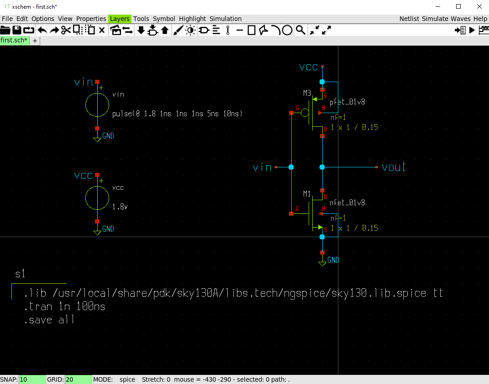

# Simulating a CMOS inverter in Xschem under sky130
## step 01: creating a schematic in xschem

&emsp; library path:" .lib /usr/local/share/pdk/sky130A/libs.tech/ngspice/sky130.lib.spice tt "
## step 02: making a symbol for the inverter ##

