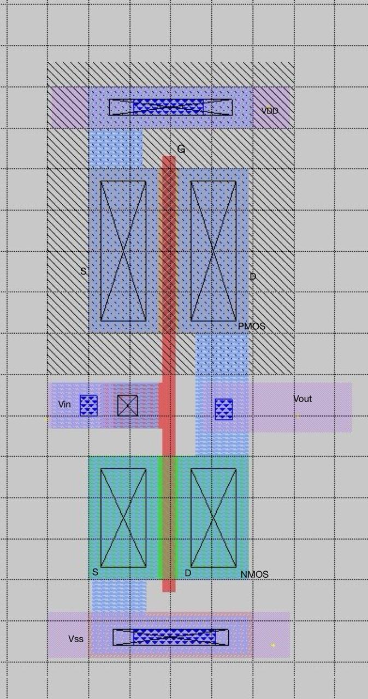

# CMOS Inverter Layout Design using Magic and SkyWater 130nm PDK

## Table of Contents
1. [Introduction](#introduction)
2. [Prerequisites](#prerequisites)
3. [Structure of the CMOS](#structure-of-the-cmos)
4. [Layout Design](#layout-design)
5. [Final Layout](#final-layout)


## Introduction
Creating the physical layout of the CMOS inverter is essential for fabrication and further analysis process. In this section, we are going to do layout designing and DRC handling, spice generation of layout and LVS checking using NETGEN.

## Prerequisites
- Magic VLSI
- SkyWater 130nm PDK
- WSL (Windows Subsystem for Linux) if running on Windows or linux based system

## Structure of the CMOS 
Before moving into layout design we have to get some idea about the physical structure of a CMOS transistor in Silicon level. It includes key structures like diffusion areas, gate oxides, polysilicon gates, metal layers and vias etc.
  

**Active Area (Diffusion):** Regions where transistors are formed. These areas are doped to create n-type or p-type regions. 
 
 **Gate Oxide:** A thin layer of SiO₂ between the gate and the channel region of the transistor.  
 
**Polysilicon Gate:** The gate electrode controlling the transistor's operation, formed above the gate oxide.

**Contacts and Vias:** Metal connections that link the transistors to interconnect layers and power supply. 

**Metal Layers:** Conductive layers (e.g., metal1, metal2) used for interconnections between different components.

## Layout Design

### Integrating Magic with Sky130
1. **Open Magic with SkyWater PDK:**
    ```bash
    magic -rcfile /usr/local/share/pdk/sky130A/libs.tech/magic/sky130A.magicrc
    ```
   This command opens two windows: one for layout and another terminal. Both windows are very important in this process.

2. **Enable Grid:**
    ```tcl
    grid 50nm 50nm
    ```
   Use `50nm` because the channel length of NMOS and PMOS is `150nm`, which is a multiple of `50nm`. YOU can change the grid size as you want by this command in magic terminal or simply you can select grid options in window tab in magic.

3. **Zoom Commands:**
   - Zoom Out: `Shift + Z`
   - Zoom In: `Ctrl + Z`

4. **Creating a Box:**
   - Select the left bottom corner of the box with the left mouse button.
   - Select the right top corner of the box with the right mouse button.
   - Use the command to snap the box to the grid points:
     ```tcl
     snap user 50nm
     ```
     or simply use window tab Grid ON option. 

5. **Check DRC Errors:**
    ```tcl
    drc find
    ```
    Design rule check(DRC)- this process ensures that the design we did in magic is practically manufacturable according to standards. You can further study about them [visit skywater](https://skywater-pdk.readthedocs.io/en/main/) 

### Design Process 

When we design  a PMOS we have to first add n-well in the default p-type wafer given in magic. Then for source and drain parts we add p-diffusion on n-well and then a polysilicon layer for gate. For the NMOS same process but we place n-diif on the default p-layer. Then add ntap or ptap on substrate for the base and add the li layer and connect with them by ntapc or ptapc respectively. Use PDC or NDC as vias to connect li with diffusion areas. Add metal layers and vias(mcon) to connect li according to requirements. Then label the layers. This is the process very simply. [refer](https://www.vlsi4freshers.com/2020/03/cmos-fabrication-process.html)


### Layout Creation
select the wanted area using the above method and then use terminal for below seteps.
1. **Draw the PMOS Transistor:**
   - Paint the n-well:
     ```tcl
     paint nwell
     ```
   - Draw the p-diffusion:
     ```tcl
     paint pdiff
     ```

2. **Draw the NMOS Transistor:**

   - Draw the n-diffusion outside the nwell of PMOS:
     ```tcl
     paint ndiff
     ```

3. **Add Polysilicon Gate:**
    ```tcl
    paint poly
    ```
After drawing the transistors connect them according to schematic using li and metal layers.

4. **Connect Using li Layers:**
   - Use LI for local interconnections:
     ```tcl
     paint li
     ```

5. **Add licon(PDC or NDC) for Connections of li and pdiff or ndiff (use relevant):**
    ```tcl
    paint PDC
    paint NDC
    ```
 Then as above use paint ptap , paint ntap, paint natpc, paint ptapc,....... as required.  
 
 6. **Design Rule Check (DRC):**
    ```tcl
    drc check
    ```
    It's a good practice to check DRC when you do a change. You can view the DRC manger window by options menu then toggle the drc manager.IF all DRC are clear then extract the spice file from the layout.

## Final Layout



   

7. **Extract the Layout:**
    ```tcl
    extract all
    ```
8. **Extract the spice file**
    ```tcl
    ext2spice file_name.ext
    ```
    
